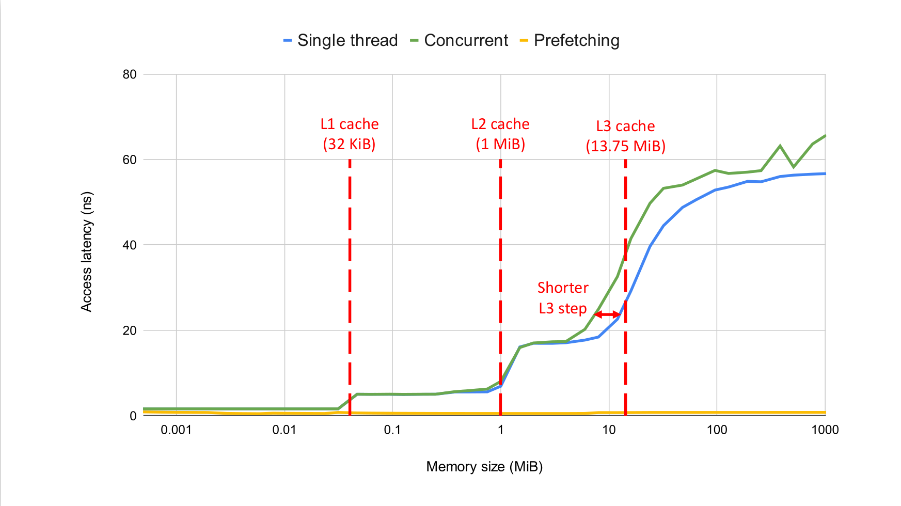

# Memory latency test

This tool measures the access latency of the memory hierarchy of a machine (cache and RAM).

It accesses data spread over memory areas of increasing size; when the size fits a specific cache level, all data accesses should result in a hit at that level, and pay the corresponding latency price.
To prevent hardware prefetching from impacting the results, the tool leverages the same memory access pattern used by the memory latency test of [lmbench](https://lmbench.sourceforge.net/): memory is split into items of the size of a cache line, each item contains the pointer to the next item to access, and pointers are chained to jump backward of a certain stride.
For each memory size, multiple accesses are performed and the average access time is reported.

## Building
Simply run `make` in the main folder of the project.

## Running
```
Usage: ./memtest [OPTIONS]
Options:
  -l, --line-size       Size of a cache line in B (default 64)
  -a, --accesses        Number of memory accesses for each memory size (default 10000000)
  -s, --stride          Stride between two consecutive memory accesses in B (default 512)
  -m, --max-size        Maximum size of tested memory in MiB (default 1024)
  -f, --forward         Forward memory scan (default backward)
  -i, --index           Index-based memory scan (default pointer-based)
  -c, --concurrent      Run the test on two concurrent threads
```
Example output for an Intel Xeon Silver 4114 CPU:
```
Running backward pointer-based scan on one thread.
Cache line size 64 B, max memory size 1024 MiB.
Performing 10000000 accesses per size.

Thread, Mem size (MiB), Access latency (ns)
0, 0.00049, 1.605
0, 0.00098, 1.605
0, 0.00195, 1.605
0, 0.00293, 1.605
0, 0.00391, 1.606
0, 0.00586, 1.613
0, 0.00781, 1.605
0, 0.01172, 1.605
0, 0.01562, 1.605
0, 0.02344, 1.606
0, 0.03125, 1.607
0, 0.04688, 5.011
0, 0.06250, 5.040
0, 0.09375, 5.062
0, 0.12500, 5.034
0, 0.18750, 5.028
0, 0.25000, 5.048
0, 0.37500, 5.596
0, 0.50000, 5.572
0, 0.75000, 6.789
0, 1.00000, 10.188
0, 1.50000, 15.152
0, 2.00000, 17.183
0, 3.00000, 17.384
0, 4.00000, 17.472
0, 6.00000, 18.256
0, 8.00000, 18.683
0, 12.00000, 23.318
0, 16.00000, 33.037
0, 24.00000, 41.318
0, 32.00000, 46.170
0, 48.00000, 50.796
0, 64.00000, 52.078
0, 96.00000, 53.798
0, 128.00000, 54.895
0, 192.00000, 55.120
0, 256.00000, 55.988
0, 384.00000, 56.475
0, 512.00000, 57.039
0, 768.00000, 57.705
0, 1024.00000, 57.129
```
Results plotted using a logarithmic scale for the memory size:
